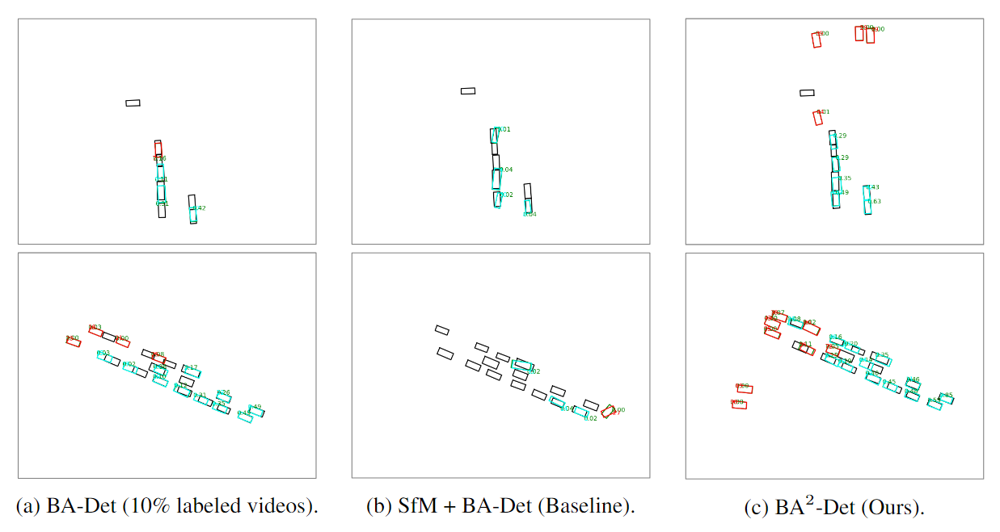
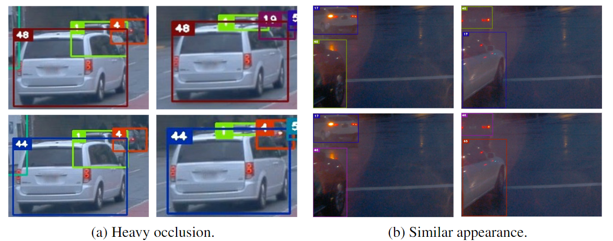
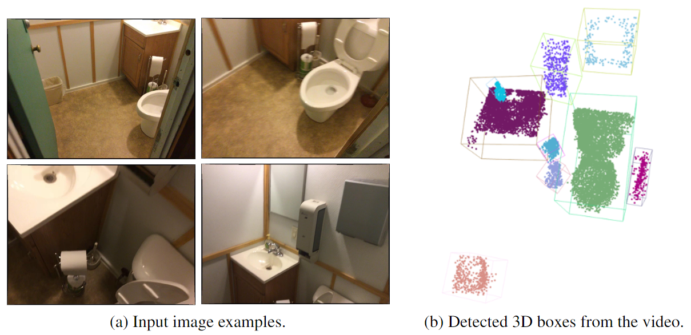

<div align="center">
<h1>BA<sup>2</sup>-Det</h1>
<h3>2D Supervised Monocular 3D Object Detection by Global-to-Local 3D Reconstruction</h3>
<h3>  [<a href="https://arxiv.org/abs/2306.05418">arXiv</a>] [<a href="https://ba2det.site/">Project Page</a>]
</div>

### A joint work: video-based 3D representation for 2D MOT [[arXiv](https://arxiv.org/abs/2306.05416)]

## Abstract
***TL;DR: We propose a novel 2D supervised monocular 3D object detection paradigm, leveraging the idea of global (scene-level) to local (instance-level) 3D reconstruction.***

With the advent of the big model era, the demand for data has become more important. Especially in monocular 3D object detection, expensive manual annotations potentially limit further developments. 
Existing works have investigated weakly supervised algorithms with the help of LiDAR modality to generate 3D pseudo labels, which cannot be applied to ordinary videos. 
In this paper, we propose a novel paradigm, termed as BA<sup>2</sup>-Det, leveraging the idea of global-to-local 3D reconstruction for 2D supervised monocular 3D object detection.
Specifically, we recover 3D structures from monocular videos by scene-level global reconstruction with global bundle adjustment (BA) and obtain object clusters by the DoubleClustering algorithm. Learning from completely reconstructed objects in global BA, GBA-Learner predicts pseudo labels for occluded objects. Finally, we train an LBA-Learner with object-centric local BA to generalize the generated 3D pseudo labels to moving objects. 
Experiments on the large-scale Waymo Open Dataset show that the performance of BA<sup>2</sup>-Det is on par with the fully-supervised BA-Det trained with 10% videos and even outperforms some pioneer fully-supervised methods. 
We also show the great potential of BA<sup>2</sup>-Det for detecting open-set 3D objects in complex scenes.
## Methodology

Pipeline of BA2-Det. We take the video sequence as input. The Global BA stage is to generate 3D pseudo labels from scene-level global reconstruction, including DoubleCluster and GBA-Learner. Then the labels are sent to the Local BA stage, which is to learn a monocular 3D object detector in an iterative way.
## Demos
***Please refer to our [project page](https://ba2det.site/) for video demos.***
  
We show demos for 
+ Monocular 3D Object Detection and Tracking
[](https://ba2det.site/)

+ 2D Multiple Object Tracking with 3D Representation
[](https://ba2det.site/)

+ Open-set Monocular 3D Object Detection
[](https://ba2det.site/)
## Citations
BA<sup>2</sup>-Det:
```
@article{he2023ba2det,
  title={2D Supervised Monocular 3D Object Detection by Global-to-Local 3D Reconstruction},
  author={Jiawei He and Yuqi Wang and Yuntao Chen and Zhaoxiang Zhang},
  journal={arXiv preprint arXiv:2306.05418},
  year={2023}
}

```
P3DTrack:
```
@article{he2023p3dtrack,
  title={Tracking Objects with 3D Representation from Videos},
  author={Jiawei He and Lue Fan and Yuqi Wang and Yuntao Chen and Zehao Huang and Naiyan Wang and Zhaoxiang Zhang},
  journal={arXiv preprint arXiv:2306.05416},
  year={2023}
}
```
## Acknowledgement
The authors thank these great works:
[FSD](https://github.com/tusen-ai/SST),[SAM](https://github.com/facebookresearch/segment-anything),[COLMAP](https://github.com/colmap/colmap),[hloc](https://github.com/cvg/Hierarchical-Localization), [SuperGlue](https://github.com/magicleap/SuperGluePretrainedNetwork),[LoFTR](https://github.com/zju3dv/LoFTR).
